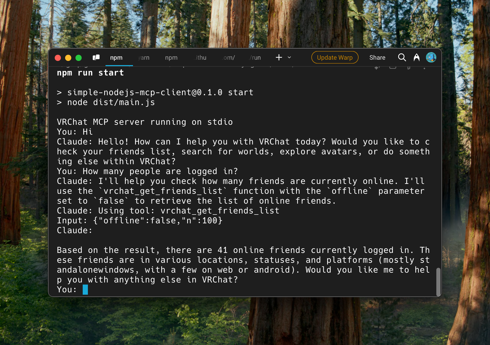

# simple-nodejs-mcp-client

This is a study repository for implementing a Model Context Protocol (MCP) client. It features a simple interactive MCP client implemented in Node.js.



## Installation

```bash
npm install
```

## Configuration

1. Copy the example configuration file:
```bash
cp config.example.json config.json
```

2. Edit `config.json` and update the configuration values with your own settings:
- `claudeApiKey`: Your Claude API key
- `systemPrompt`: The system prompt for the anthorpic client
- `mcpServers`: Configuration for MCP servers (if needed)

## Usage

1. Build the project:
```bash
npm run build
```

2. Start the client:
```bash
npm run start
```

## License

See [LICENSE](./LICENSE) file for details.
